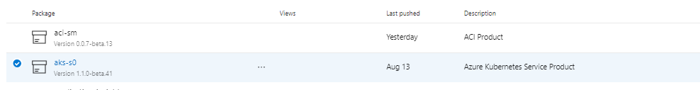
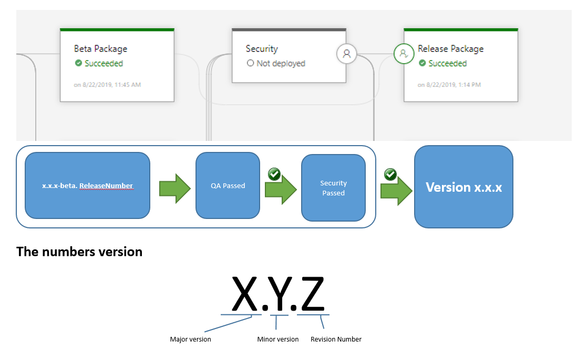
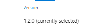

## Purpose  
  
Find here the collection of all the AZURE products offered by the CCoE (Cloud Center of Excellence).  
**Reference document:** [List of Acronyms](https://confluence.alm.europe.cloudcenter.corp/display/OPTIMUM/List+of+Acronyms)  
  
## Artifact Naming and Product Version  
  
The product policy version decided by the CCoE Products team is:  
  
* **Artifact Name**
  * Product_Name-SM
    * **Product_Name**: Name of the product developed by product team
    * **SX**: Security Control Framework: Basic (SB), Medium (SM), Advanced (SA)  
  
    Example:    

         
  
* **Versions**: Product version to implement
  * **x.x.x-beta. ReleaseNumber**: 
    * **x.x.x**: Number of  version to implement
    * **-Beta.1**: Beta **indicate a product in Technical Readiness status**, the number indicate the release number where was generated the beta artifact  
  
* **x.x.x**  
    **When the QA and Security teams approve the product on their release steps, only if all test are passed and all security finding are fixed by product team, the product will be publish in a major version.**  
  
         
   
    Example:  
  
         
  
**Product Support**  
Any bug found on a product version, will be solved in the latest major version and is necessary to update always the product version to the latest major version product available.  
  
## Product Summary   
  

                    

                        

                            <h4 class="panel-title">
                                <a class="noCrossRef accordion-toggle" data-toggle="collapse" data-parent="#accordion" href="#collapseOne">aps - Azure PostgreSQL</a>
                            </h4>
                        

                        

                            

                            
Azure Database for PostgreSQL is a relational database service based on the open-source Postgres database engine. It’s a fully managed database-as-a-service offering that can handle mission-critical workloads with predictable performance, security, high availability, and dynamic scalability. It’s available in two deployment options, as a single server and as a Hyperscale (Citus) cluster. The Hyperscale (Citus) option horizontally scales queries across multiple machines using sharding, and serves applications that require greater scale and performance.
 
                            <a href="https://docs.microsoft.com/en-us/azure/postgresql/overview">Azure Documentation</a> 
                            

                            <table>
                              <thead>
                              <tr>
                                  <th>iac.az.modules.aps-sm</th>
                                  <th></th>
                              </tr>
                              </thead>
                              <tbody>
                              <tr>
                                  <td>Git Repo</td>
                                  <td><a href="https://github.alm.europe.cloudcenter.corp/ccc-ccoe/iac.az.modules.aps-sm/tree/v2.2.0">Source Code</a></td>
                              </tr>
                              <tr>
                                  <td>README</td>
                                  <td><a href="https://github.alm.europe.cloudcenter.corp/ccc-ccoe/iac.az.modules.aps-sm/blob/v2.2.0/README.md">README</a> </td>
                              </tr>
                              <tr>
                                  <td><b>Latest Release Version</b></td>
                                  <td><b>v2.2.0</b></td>
                              </tr>
                              <tr>
                                  <td>Status</td>
                                  <td>Published</td>
                              </tr>
                              <tr>
                                  <td>Support</td>
                                  <td>Yes</td>
                              </tr>
                              </tbody>
                            </table>
                            

                        

                    

                    <!-- /.panel -->
                    

                        

                            <h4 class="panel-title">
                                <a class="noCrossRef accordion-toggle" data-toggle="collapse" data-parent="#accordion" href="#collapseTwo">waf - Azure Web Application Firewall</a>
                            </h4>
                        

                        

                            

                            
Web Application Firewall (WAF) provides centralized protection of your web applications from common exploits and vulnerabilities. You can deploy WAF on Azure Application Gateway or WAF on Azure Front Door Service.
 
                            <a href="https://docs.microsoft.com/en-us/azure/web-application-firewall/">Azure Documentation</a> 
                            

                            <table>
                              <thead>
                              <tr>
                                  <th>iac.az.modules.waf-sm</th>
                                  <th></th>
                              </tr>
                              </thead>
                              <tbody>
                              <tr>
                                  <td>Git Repo</td>
                                  <td><a href="https://github.alm.europe.cloudcenter.corp/ccc-ccoe/iac.az.modules.waf-sm/tree/v2.1.1">Source Code</a></td>
                              </tr>
                              <tr>
                                  <td>README</td>
                                  <td><a href="https://github.alm.europe.cloudcenter.corp/ccc-ccoe/iac.az.modules.waf-sm/blob/v2.1.1/README.md">README</a> </td>
                              </tr>
                              <tr>
                                  <td><b>Latest Release Version</b></td>
                                  <td><b>v2.1.1</b></td>
                              </tr>
                              <tr>
                                  <td>Status</td>
                                  <td>Published</td>
                              </tr>
                              <tr>
                                  <td>Support</td>
                                  <td>Yes</td>
                              </tr>
                              </tbody>
                            </table>
                            

                        

                    

                    <!-- /.panel -->
                    

                        

                            <h4 class="panel-title">
                                <a class="noCrossRef accordion-toggle" data-toggle="collapse" data-parent="#accordion" href="#collapseThree">ams - Azure API Management</a>
                            </h4>
                        

                        

                            

                            

 
                            <a href="https://confluence.alm.europe.cloudcenter.corp/display/ARCHTECH/APIs+Management+vs+API+Gateway">Documentation</a> 
                            

                            <table>
                              <thead>
                              <tr>
                                  <th>iac.az.modules.ams</th>
                                  <th></th>
                              </tr>
                              </thead>
                              <tbody>
                              <tr>
                                  <td>Git Repo</td>
                                  <td><a href="https://github.alm.europe.cloudcenter.corp/ccc-ccoe/iac.az.modules.ams/tree/v2.1.0-beta.1">Source Code</a></td>
                              </tr>
                              <tr>
                                  <td>README</td>
                                  <td><a href="https://github.alm.europe.cloudcenter.corp/ccc-ccoe/iac.az.modules.ams/blob/v2.1.0-beta.1/README.md">README</a> </td>
                              </tr>
                              <tr>
                                  <td><b>Latest Release Version</b></td>
                                  <td><b>v2.1.0-beta.1</b></td>
                              </tr>
                              <tr>
                                  <td>Status</td>
                                  <td>Published</td>
                              </tr>
                              <tr>
                                  <td>Support</td>
                                  <td>Yes</td>
                              </tr>
                              </tbody>
                            </table>
                            

                        

                    

                    <!-- /.panel -->
                    

                        

                            <h4 class="panel-title">
                                <a class="noCrossRef accordion-toggle" data-toggle="collapse" data-parent="#accordion" href="#collapseFour">sql - Azure SQL Database</a>
                            </h4>
                        

                        

                            

                            
Azure SQL Database is a general-purpose relational database, provided as a managed service. With it, you can create a highly available and high-performance data storage layer for the applications and solutions in Azure. SQL Database can be the right choice for a variety of modern cloud applications because it enables you to process both relational data and <a href="https://docs.microsoft.com/bs-cyrl-ba/Azure/sql-database/sql-database-multi-model-features">non-relational structures</a>, such as graphs, JSON, spatial, and XML.
 
                            <a href="https://docs.microsoft.com/bs-cyrl-ba/Azure/sql-database/sql-database-technical-overview">Azure Documentation</a> 
                            

                            <table>
                              <thead>
                              <tr>
                                  <th>iac.az.modules.azure-sql-sm</th>
                                  <th></th>
                              </tr>
                              </thead>
                              <tbody>
                              <tr>
                                  <td>Git Repo</td>
                                  <td><a href="https://github.alm.europe.cloudcenter.corp/ccc-ccoe/iac.az.modules.azure-sql-sm/tree/v2.1.0-beta1">Source Code</a></td>
                              </tr>
                              <tr>
                                  <td>README</td>
                                  <td><a href="https://github.alm.europe.cloudcenter.corp/ccc-ccoe/iac.az.modules.azure-sql-sm/blob/v2.1.0-beta1/README.md">README</a> </td>
                              </tr>
                              <tr>
                                  <td><b>Latest Release Version</b></td>
                                  <td><b>v2.1.0-beta1</b></td>
                              </tr>
                              <tr>
                                  <td>Status</td>
                                  <td>Published</td>
                              </tr>
                              <tr>
                                  <td>Support</td>
                                  <td>Yes</td>
                              </tr>
                              </tbody>
                            </table>
                            

                        

                    

                    <!-- /.panel -->
                    

                        

                            <h4 class="panel-title">
                                <a class="noCrossRef accordion-toggle" data-toggle="collapse" data-parent="#accordion" href="#collapseFive">adb - Azure Databricks</a>
                            </h4>
                        

                        

                            

                            
Azure Databricks is an Apache Spark-based analytics platform optimized for the Microsoft Azure cloud services platform. Designed with the founders of Apache Spark, Databricks is integrated with Azure to provide one click setup, streamlined workflows, and an interactive workspace that enables collaboration between data scientists, data engineers, and business analysts.

                            
Azure Databricks is a fast, easy, and collaborative Apache Spark based analytics service. For a big data pipeline, the data (raw or structured) is ingested into Azure through Azure Data Factory in batches, or streamed near real time using Kafka, Event Hub, or IoT Hub. This data lands in a data lake for long term persisted storage, in Azure Blob Storage or Azure Data Lake Storage. As part of your analytics workflow, use Azure Databricks to read data from multiple data sources such as Azure Blob Storage, Azure Data Lake Storage, Azure Cosmos DB, or Azure SQL Data Warehouse and turn it into breakthrough insights using Spark.
 
                            <a href="https://confluence.alm.europe.cloudcenter.corp/display/OPTIMUM/Databricks+network+access+requirements">Azure Documentation</a> 
                            

                            <table>
                              <thead>
                              <tr>
                                  <th>iac.az.modules.adb</th>
                                  <th></th>
                              </tr>
                              </thead>
                              <tbody>
                              <tr>
                                  <td>Git Repo</td>
                                  <td><a href="https://github.alm.europe.cloudcenter.corp/ccc-ccoe/iac.az.modules.databricks-sm/tree/v2.1.0-beta1">Source Code</a></td>
                              </tr>
                              <tr>
                                  <td>README</td>
                                  <td><a href="https://github.alm.europe.cloudcenter.corp/ccc-ccoe/iac.az.modules.databricks-sm/blob/v2.1.0-beta1/README.md">README</a> </td>
                              </tr>
                              <tr>
                                  <td><b>Latest Release Version</b></td>
                                  <td><b>v2.1.0-beta1</b></td>
                              </tr>
                              <tr>
                                  <td>Status</td>
                                  <td>Published</td>
                              </tr>
                              <tr>
                                  <td>Support</td>
                                  <td>Yes</td>
                              </tr>
                              </tbody>
                            </table>
                            

                        

                    

                    <!-- /.panel -->
                    

                        

                            <h4 class="panel-title">
                                <a class="noCrossRef accordion-toggle" data-toggle="collapse" data-parent="#accordion" href="#collapseSix">aci - Azure Container Instances</a>
                            </h4>
                        

                        

                            

                            
Azure Container Instances offers the fastest and simplest way to run a container in Azure, without having to provision any virtual machines and without having to adopt a higher-level service. By running your workloads in Azure Container Instances (ACI), you can focus on designing and building your applications instead of managing the infrastructure that runs them.
 
                            <a href="https://azure.microsoft.com/en-us/services/container-instances/">Azure Documentation</a> 
                            

                            <table>
                              <thead>
                              <tr>
                                  <th>iac.az.modules.aci-sm</th>
                                  <th></th>
                              </tr>
                              </thead>
                              <tbody>
                              <tr>
                                  <td>Git Repo</td>
                                  <td><a href="https://github.alm.europe.cloudcenter.corp/ccc-ccoe/iac.az.modules.aci-sm/tree/v2.1.0-beta.1">Source Code</a></td>
                              </tr>
                              <tr>
                                  <td>README</td>
                                  <td><a href="https://github.alm.europe.cloudcenter.corp/ccc-ccoe/iac.az.modules.aci-sm/blob/v2.1.0-beta.1/README.md">README</a> </td>
                              </tr>
                              <tr>
                                  <td><b>Latest Release Version</b></td>
                                  <td><b>v2.1.0-beta.1</b></td>
                              </tr>
                              <tr>
                                  <td>Status</td>
                                  <td>Published</td>
                              </tr>
                              <tr>
                                  <td>Support</td>
                                  <td>Yes</td>
                              </tr>
                              </tbody>
                            </table>
                            

                        

                    

                    <!-- /.panel -->
                    

                        

                            <h4 class="panel-title">
                                <a class="noCrossRef accordion-toggle" data-toggle="collapse" data-parent="#accordion" href="#collapseSeven">adl - Azure Data Lake Gen 1</a>
                            </h4>
                        

                        

                            

                            
Microsoft Azure Data Lake is a highly scalable public cloud service that allows developers, scientists, business professionals and other Microsoft customers to gain insight from large, complex data sets. As with most data lake offerings, the service is composed of two parts: data storage and data analytics.
 
                            <a href="https://docs.microsoft.com/en-us/azure/data-lake-store/data-lake-store-overview">Azure Documentation</a> 
                            

                            <table>
                              <thead>
                              <tr>
                                  <th>iac.az.modules.data-lake-storage-gen1-sm</th>
                                  <th></th>
                              </tr>
                              </thead>
                              <tbody>
                              <tr>
                                  <td>Git Repo</td>
                                  <td><a href="https://github.alm.europe.cloudcenter.corp/ccc-ccoe/iac.az.modules.data-lake-storage-gen1-sm/tree/v2.1.0">Source Code</a></td>
                              </tr>
                              <tr>
                                  <td>README</td>
                                  <td><a href="https://github.alm.europe.cloudcenter.corp/ccc-ccoe/iac.az.modules.data-lake-storage-gen1-sm/blob/v2.1.0/README.md">README</a> </td>
                              </tr>
                              <tr>
                                  <td><b>Latest Release Version</b></td>
                                  <td><b>v2.1.0</b></td>
                              </tr>
                              <tr>
                                  <td>Status</td>
                                  <td>Published</td>
                              </tr>
                              <tr>
                                  <td>Support</td>
                                  <td>Yes</td>
                              </tr>
                              </tbody>
                            </table>
                            

                        

                    

                    <!-- /.panel -->
                    

                        

                            <h4 class="panel-title">
                                <a class="noCrossRef accordion-toggle" data-toggle="collapse" data-parent="#accordion" href="#collapseEight">aeh - Azure Event Hub</a>
                            </h4>
                        

                        

                            

                            
Azure Event Hubs is a big data streaming platform and event ingestion service. It can receive and process millions of events per second. Data sent to an event hub can be transformed and stored by using any real-time analytics provider or batching/storage adapters.

                            
Event Hubs provides a Kafka endpoint that can be used by your existing Kafka based applications as an alternative to running your own Kafka cluster. Event Hubs supports Apache Kafka protocol 1.0 and later, and works with your existing Kafka applications, including MirrorMaker.
 
                            <a href="https://docs.microsoft.com/en-us/azure/event-hubs/event-hubs-about">Azure Documentation</a> 
                            

                            <table>
                              <thead>
                              <tr>
                                  <th>iac.az.modules.event-hub-sm</th>
                                  <th></th>
                              </tr>
                              </thead>
                              <tbody>
                              <tr>
                                  <td>Git Repo</td>
                                  <td><a href="https://github.alm.europe.cloudcenter.corp/ccc-ccoe/iac.az.modules.event-hub-sm/tree/v2.0.0">Source Code</a></td>
                              </tr>
                              <tr>
                                  <td>README</td>
                                  <td><a href="https://github.alm.europe.cloudcenter.corp/ccc-ccoe/iac.az.modules.event-hub-sm/blob/v2.0.0/README.md">README</a> </td>
                              </tr>
                              <tr>
                                  <td><b>Latest Release Version</b></td>
                                  <td><b>v2.0.0</b></td>
                              </tr>
                              <tr>
                                  <td>Status</td>
                                  <td>Published</td>
                              </tr>
                              <tr>
                                  <td>Support</td>
                                  <td>Yes</td>
                              </tr>
                              </tbody>
                            </table>
                            

                        

                    

                    <!-- /.panel -->
                    

                        

                            <h4 class="panel-title">
                                <a class="noCrossRef accordion-toggle" data-toggle="collapse" data-parent="#accordion" href="#collapseNine">ais - Application Insights</a>
                            </h4>
                        

                        

                            

                            
Application Insights is an extensible Application Performance Management (APM) service for web developers on multiple platforms. It will automatically detect performance anomalies and includes powerful analytics tools to help you diagnose issues and to understand what users actually do with your app.

                            
It works for apps on a wide variety of platforms including .NET, Node.js and Java EE, hosted on-premises, hybrid, or any public cloud.
 
                            <a href="https://docs.microsoft.com/en-us/azure/azure-monitor/app/app-insights-overview">Azure Documentation</a> 
                            

                            <table>
                              <thead>
                              <tr>
                                  <th>iac.az.modules.application-insights-sm</th>
                                  <th></th>
                              </tr>
                              </thead>
                              <tbody>
                              <tr>
                                  <td>Git Repo</td>
                                  <td><a href="https://github.alm.europe.cloudcenter.corp/ccc-ccoe/iac.az.modules.application-insights-sm/tree/v2.1.0-beta1">Source Code</a></td>
                              </tr>
                              <tr>
                                  <td>README</td>
                                  <td><a href="https://github.alm.europe.cloudcenter.corp/ccc-ccoe/iac.az.modules.application-insights-sm/blob/v2.1.0-beta1/README.md">README</a> </td>
                              </tr>
                              <tr>
                                  <td><b>Latest Release Version</b></td>
                                  <td><b>v2.1.0-beta1</b></td>
                              </tr>
                              <tr>
                                  <td>Status</td>
                                  <td>Published</td>
                              </tr>
                              <tr>
                                  <td>Support</td>
                                  <td>Yes</td>
                              </tr>
                              </tbody>
                            </table>
                            

                        

                    

                    <!-- /.panel -->
                    

                        

                            <h4 class="panel-title">
                                <a class="noCrossRef accordion-toggle" data-toggle="collapse" data-parent="#accordion" href="#collapseTwelve">app - Application Service</a>
                            </h4>
                        

                        

                            

                            
Azure App Service enables you to build and host web apps, mobile back ends, and RESTful APIs in the programming language of your choice without managing infrastructure. It offers auto-scaling and high availability, security, load balancing, autoscaling, and automated management.
 
                            <a href="https://docs.microsoft.com/en-us/azure/app-service/overview">Azure Documentation</a> 
                            

                            <table>
                              <thead>
                              <tr>
                                  <th>iac.az.modules.app-service-sm</th>
                                  <th></th>
                              </tr>
                              </thead>
                              <tbody>
                              <tr>
                                  <td>Git Repo</td>
                                  <td><a href="https://github.alm.europe.cloudcenter.corp/ccc-ccoe/iac.az.modules.app-service-sm/tree/v2.1.0">Source Code</a></td>
                              </tr>
                              <tr>
                                  <td>README</td>
                                  <td><a href="https://github.alm.europe.cloudcenter.corp/ccc-ccoe/iac.az.modules.app-service-sm/blob/v2.1.0/README.md">README</a></td>
                              </tr>
                              <tr>
                                  <td><b>Latest Release Version</b></td>
                                  <td><b>v2.1.0</b></td>
                              </tr>
                              <tr>
                                  <td>Status</td>
                                  <td>Published</td>
                              </tr>
                              <tr>
                                  <td>Support</td>
                                  <td>Yes</td>
                              </tr>
                              </tbody>
                            </table>
                            

                        

                    

                    <!-- /.panel -->
                    

                        

                            <h4 class="panel-title">
                                <a class="noCrossRef accordion-toggle" data-toggle="collapse" data-parent="#accordion" href="#collapseThirdteen">arc - Azure Redis Cache</a>
                            </h4>
                        

                        

                            

                            
Azure Cache for Redis is based on the popular software Redis. It is typically used as a cache to improve the performance and scalability of systems that rely heavily on backend data-stores. Performance is improved by temporarily copying frequently accessed data to fast storage located close to the application. With Azure Cache for Redis, this fast storage is located in-memory with Azure Cache for Redis instead of being loaded from disk by a database.
 
                            <a href="https://docs.microsoft.com/en-in/azure/azure-cache-for-redis/cache-overview">Azure Documentation</a> 
                            

                            <table>
                              <thead>
                              <tr>
                                  <th>iac.az.modules.redis-cache-sm</th>
                                  <th></th>
                              </tr>
                              </thead>
                              <tbody>
                              <tr>
                                  <td>Git Repo</td>
                                  <td><a href="https://github.alm.europe.cloudcenter.corp/ccc-ccoe/iac.az.modules.redis-cache-sm/tree/v2.1.1-beta.1">Source Code</a></td>
                              </tr>
                              <tr>
                                  <td>README</td>
                                  <td><a href="https://github.alm.europe.cloudcenter.corp/ccc-ccoe/iac.az.modules.redis-cache-sm/blob/v2.1.1-beta.1/README.md">README</a> </td>
                              </tr>
                              <tr>
                                  <td><b>Latest Release Version</b></td>
                                  <td><b>v2.1.1-beta.1</b></td>
                              </tr>
                              <tr>
                                  <td>Status</td>
                                  <td>Published</td>
                              </tr>
                              <tr>
                                  <td>Support</td>
                                  <td>Yes</td>
                              </tr>
                              </tbody>
                            </table>
                            

                        

                    

                    <!-- /.panel -->
                    

                        

                            <h4 class="panel-title">
                                <a class="noCrossRef accordion-toggle" data-toggle="collapse" data-parent="#accordion" href="#collapseFourteen">ase - App Service Environment</a>
                            </h4>
                        

                        

                            

                            
The App Service Environment (ASE) is a powerful feature offering of the Azure App Service that gives network isolation and improved scale capabilities. It is essentially a deployment of the Azure App Service into a subnet of a customer’s Azure Virtual Network (VNet).
 
                            <a href="https://confluence.alm.europe.cloudcenter.corp/display/OPTIMUM/ASE+network+access+requirements">Azure Documentation</a> 
                            

                            <table>
                              <thead>
                              <tr>
                                  <th>iac.az.modules.ase-sm</th>
                                  <th></th>
                              </tr>
                              </thead>
                              <tbody>
                              <tr>
                                  <td>Git Repo</td>
                                  <td><a href="https://github.alm.europe.cloudcenter.corp/ccc-ccoe/iac.az.modules.ase-sm/tree/v2.0.0-beta1">Source Code</a></td>
                              </tr>
                              <tr>
                                  <td>README</td>
                                  <td><a href="https://github.alm.europe.cloudcenter.corp/ccc-ccoe/iac.az.modules.ase-sm/blob/v2.0.0-beta1/README.md">README</a></td>
                              </tr>
                              <tr>
                                  <td><b>Latest Release Version</b></td>
                                  <td><b> v2.0.0-beta1</b></td>
                              </tr>
                              <tr>
                                  <td>Status</td>
                                  <td>Published</td>
                              </tr>
                              <tr>
                                  <td>Support</td>
                                  <td>Yes</td>
                              </tr>
                              </tbody>
                            </table>
                            

                        

                    

                    <!-- /.panel -->
                    

                        

                            <h4 class="panel-title">
                                <a class="noCrossRef accordion-toggle" data-toggle="collapse" data-parent="#accordion" href="#collapseFifthteen">cdb - Azure Cosmos DB</a>
                            </h4>
                        

                        

                            

                            
Azure Cosmos DB is a fully managed database service with turnkey global distribution and transparent multi-master replication. You can run globally distributed, low-latency operational and analytics workloads and AI on transactional data within your database.
 
                            <a href="https://azure.microsoft.com/en-us/services/cosmos-db/">Azure Documentation</a> 
                            

                            <table>
                              <thead>
                              <tr>
                                  <th>iac.az.modules.cosmosdb-sm</th>
                                  <th></th>
                              </tr>
                              </thead>
                              <tbody>
                              <tr>
                                  <td>Git Repo</td>
                                  <td><a href="https://github.alm.europe.cloudcenter.corp/ccc-ccoe/iac.az.modules.cosmosdb-sm/tree/v2.1.0">Source Code</a></td>
                              </tr>
                              <tr>
                                  <td>README</td>
                                  <td><a href="https://github.alm.europe.cloudcenter.corp/ccc-ccoe/iac.az.modules.cosmosdb-sm/blob/v2.1.0/README.md">README</a> </td>
                              </tr>
                              <tr>
                                  <td><b>Latest Release Version</b></td>
                                  <td><b>v2.1.0</b></td>
                              </tr>
                              <tr>
                                  <td>Status</td>
                                  <td>Published</td>
                              </tr>
                              <tr>
                                  <td>Support</td>
                                  <td>Yes</td>
                              </tr>
                              </tbody>
                            </table>
                            

                        

                    

                    <!-- /.panel -->
                    

                        

                            <h4 class="panel-title">
                                <a class="noCrossRef accordion-toggle" data-toggle="collapse" data-parent="#accordion" href="#collapseSixteen">dwh - Sql Datawarehouse</a>
                            </h4>
                        

                        

                            

                            
SQL Data Warehouse is a cloud-based Enterprise Data Warehouse (EDW) that uses Massively Parallel Processing (MPP) to quickly run complex queries across petabytes of data. Use SQL Data Warehouse as a key component of a big data solution. Import big data into SQL Data Warehouse with simple PolyBase T-SQL queries, and then use the power of MPP to run high-performance analytics. As you integrate and analyze, the data warehouse will become the single version of truth your business can count on for insights.
 
                            <a href="https://docs.microsoft.com/en-us/azure/sql-data-warehouse/sql-data-warehouse-overview-what-is">Azure Documentation</a> 
                            

                            <table>
                              <thead>
                              <tr>
                                  <th>iac.az.modules.sql-data-warehouse-sm</th>
                                  <th></th>
                              </tr>
                              </thead>
                              <tbody>
                              <tr>
                                  <td>Git Repo</td>
                                  <td><a href="https://github.alm.europe.cloudcenter.corp/ccc-ccoe/iac.az.modules.sql-data-warehouse-sm/tree/v2.1.0">Source Code</a></td>
                              </tr>
                              <tr>
                                  <td>README</td>
                                  <td><a href="https://github.alm.europe.cloudcenter.corp/ccc-ccoe/iac.az.modules.sql-data-warehouse-sm/blob/v2.1.0/README.md">README</a> </td>
                              </tr>
                              <tr>
                                  <td><b>Latest Release Version</b></td>
                                  <td><b>v2.1.0</b></td>
                              </tr>
                              <tr>
                                  <td>Status</td>
                                  <td>Published</td>
                              </tr>
                              <tr>
                                  <td>Support</td>
                                  <td>Yes</td>
                              </tr>
                              </tbody>
                            </table>
                            

                        

                    

                    <!-- /.panel -->    
                    

                        

                            <h4 class="panel-title">
                                <a class="noCrossRef accordion-toggle" data-toggle="collapse" data-parent="#accordion" href="#collapseSeventeen">hdi - Azure HDInsight Kafka</a>
                            </h4>
                        

                        

                            

                            
<b>Azure HDInsight</b> is a cloud distribution of Hadoop components. Azure HDInsight makes it easy, fast, and cost-effective to process massive amounts of data.You can use the most popular open-source frameworks such as Hadoop, Spark, Hive, LLAP, Kafka, Storm, R, and more. With these frameworks, you can enable a broad range of scenarios such as extract, transform, and load (ETL), data warehousing, machine learning, and IoT.

                            
<b>Apache Kafka</b> is an open-source distributed streaming platform that can be used to build real-time streaming data pipelines and applications. Kafka also provides message broker functionality similar to a message queue, where you can publish and subscribe to named data streams.

                            
The following are specific characteristics of Kafka on HDInsight: 
                            <ul>
                            <li>It is a managed service that provides a simplified configuration process. The result is a configuration that is tested and supported by Microsoft.</li>
                            <li>Microsoft provides a 99.9% Service Level Agreement (SLA) on Kafka uptime.</li>
                            <li>It uses Azure Managed Disks as the backing store for Kafka. Managed Disks can provide up to 16 TB of storage per Kafka broker.</li>
                            <li>Kafka was designed with a single dimensional view of a rack. Azure separates a rack into two dimensions - Update Domains (UD) and Fault Domains (FD). Microsoft provides tools that rebalance Kafka partitions and replicas across UDs and FDs.</li>
                            <li>HDInsight allows you to change the number of worker nodes (which host the Kafka-broker) after cluster creation. Scaling can be performed from the Azure portal, Azure PowerShell, and other Azure management interfaces. For Kafka, you should rebalance partition replicas after scaling operations. Rebalancing partitions allows Kafka to take advantage of the new number of worker nodes.</li>
                            <li>Azure Monitor logs can be used to monitor Kafka on HDInsight. Azure Monitor logs surfaces virtual machine level information, such as disk and NIC metrics, and JMX metrics from Kafka.</li></ul>
 
                            <a href="https://docs.microsoft.com/es-es/azure/hdinsight/hdinsight-overview">Azure Documentation</a> 
                            

                            <table>
                              <thead>
                              <tr>
                                  <th>iac.az.modules.hdi-kafka-sa</th>
                                  <th></th>
                              </tr>
                              </thead>
                              <tbody>
                              <tr>
                                  <td>Git Repo</td>
                                  <td><a href="https://github.alm.europe.cloudcenter.corp/ccc-ccoe/iac.az.modules.hdi-kafka-sa/tree/v2.1.0-beta.1">Source Code</a></td>
                              </tr>
                              <tr>
                                  <td>README</td>
                                  <td><a href="https://github.alm.europe.cloudcenter.corp/ccc-ccoe/iac.az.modules.hdi-kafka-sa/blob/v2.1.0-beta.1/README.md">README</a> </td>
                              </tr>
                              <tr>
                                  <td><b>Latest Release Version</b></td>
                                  <td><b>v2.1.0-beta.1</b></td>
                              </tr>
                              <tr>
                                  <td>Status</td>
                                  <td>Published</td>
                              </tr>
                              <tr>
                                  <td>Support</td>
                                  <td>Yes</td>
                              </tr>
                              </tbody>
                            </table>
                            

                        

                    

                    <!-- /.panel --> 
                    

                        

                            <h4 class="panel-title">
                                <a class="noCrossRef accordion-toggle" data-toggle="collapse" data-parent="#accordion" href="#collapseNineteen">lba - Load Balancer</a>
                            </h4>
                        

                        

                            

                            
With Azure Load Balancer, you can scale your applications and create high availability for your services. Load Balancer supports inbound and outbound scenarios, provides low latency and high throughput, and scales up to millions of flows for all TCP and UDP applications.
 
                            <a href="https://docs.microsoft.com/en-us/azure/load-balancer/load-balancer-overview">Azure Documentation</a> 
                            

                            <table>
                              <thead>
                              <tr>
                                  <th>iac.az.modules.lba-sm</th>
                                  <th></th>
                              </tr>
                              </thead>
                              <tbody>
                              <tr>
                                  <td>Git Repo</td>
                                  <td><a href="https://github.alm.europe.cloudcenter.corp/ccc-ccoe/iac.az.modules.lba-sm/tree/v2.1.0">Source Code</a></td>
                              </tr>
                              <tr>
                                  <td>README</td>
                                  <td><a href="https://github.alm.europe.cloudcenter.corp/ccc-ccoe/iac.az.modules.lba-sm/blob/v2.1.0/README.md">README</a> </td>
                              </tr>
                              <tr>
                                  <td><b>Latest Release Version</b></td>
                                  <td><b>v2.1.0</b></td>
                              </tr>
                              <tr>
                                  <td>Status</td>
                                  <td>Published</td>
                              </tr>
                              <tr>
                                  <td>Support</td>
                                  <td>Yes</td>
                              </tr>
                              </tbody>
                            </table>
                            

                        

                    

                    <!-- /.panel -->  
                    

                        

                            <h4 class="panel-title">
                                <a class="noCrossRef accordion-toggle" data-toggle="collapse" data-parent="#accordion" href="#collapseTwentyone">mss - MySQL Server</a>
                            </h4>
                        

                        

                            

                            

 
                            

                            <table>
                              <thead>
                              <tr>
                                  <th>iac.az.modules.mss-sm</th>
                                  <th></th>
                              </tr>
                              </thead>
                              <tbody>
                              <tr>
                                  <td>Git Repo</td>
                                  <td><a href="https://github.alm.europe.cloudcenter.corp/ccc-ccoe/iac.az.modules.mss-sm/tree/v2.2.0-beta1">Source Code</a></td>
                              </tr>
                              <tr>
                                  <td>README</td>
                                  <td><a href="https://github.alm.europe.cloudcenter.corp/ccc-ccoe/iac.az.modules.mss-sm/blob/v2.2.0-beta1/README.md">README</a> </td>
                              </tr>
                              <tr>
                                  <td><b>Latest Release Version</b></td>
                                  <td><b>v2.2.0-beta1</b></td>
                              </tr>
                              <tr>
                                  <td>Status</td>
                                  <td>Published</td>
                              </tr>
                              <tr>
                                  <td>Support</td>
                                  <td>Yes</td>
                              </tr>
                              </tbody>
                            </table>
                            

                        

                    

                    <!-- /.panel -->
                    

                        

                            <h4 class="panel-title">
                                <a class="noCrossRef accordion-toggle" data-toggle="collapse" data-parent="#accordion" href="#collapseTwentyfour">vml - Virtual Machine with Managed Disks</a>
                            </h4>
                        

                        

                            

                            
A managed Azure disk is a virtual hard disk (VHD). It can be considered as a physical disk on a server in the local environment, but virtualized. Azure managed disks are stored as blobs on pages, which are a random I/O storage object in Azure. We call managed these disks because it is an abstraction about the blobs in pages, the blobs containers and the Azure storage accounts. With managed disks, all you have to do is provision the disk and Azure takes care of the rest.
 
                            <a href="https://docs.microsoft.com/en-us/azure/virtual-machines/linux/managed-disks-overview">Azure Documentation</a> 
                            

                            <table>
                              <thead>
                              <tr>
                                  <th>iac.az.modules.virtual-machine-sm</th>
                                  <th></th>
                              </tr>
                              </thead>
                              <tbody>
                              <tr>
                                  <td>Git Repo</td>
                                  <td><a href="https://github.alm.europe.cloudcenter.corp/ccc-ccoe/iac.az.modules.virtual-machine-sm/tree/v2.4.0">Source Code</a></td>
                              </tr>
                              <tr>
                                  <td>README</td>
                                  <td><a href="https://github.alm.europe.cloudcenter.corp/ccc-ccoe/iac.az.modules.virtual-machine-sm/blob/v2.4.0/README.md">README</a> </td>
                              </tr>
                              <tr>
                                  <td><b>Latest Release Version</b></td>
                                  <td><b>v2.4.0</b></td>
                              </tr>
                              <tr>
                                  <td>Status</td>
                                  <td>Published</td>
                              </tr>
                              <tr>
                                  <td>Support</td>
                                  <td>Yes</td>
                              </tr>
                              </tbody>
                            </table>
                            

                        

                    

                    <!-- /.panel -->
                    

                        

                            <h4 class="panel-title">
                                <a class="noCrossRef accordion-toggle" data-toggle="collapse" data-parent="#accordion" href="#collapseTwentyfive">vml - Virtual machine with unmanaged Disks</a>
                            </h4>
                        

                        

                            

                            
Virtual Machine using unmmaged disks and supports Linux or Windows Server images. The VM disks are in Blob Storage. Storage account is required to host VMs OS & Data Disks.
                             
                            

                            <table>
                              <thead>
                              <tr>
                                  <th>iac.az.modules.virtual-machine-unmanaged-disks-sm</th>
                                  <th></th>
                              </tr>
                              </thead>
                              <tbody>
                              <tr>
                                  <td>Git Repo</td>
                                  <td><a href="https://github.alm.europe.cloudcenter.corp/ccc-ccoe/iac.az.modules.virtual-machine-unmanaged-disks-sm/tree/v2.1.0">Source Code</a></td>
                              </tr>
                              <tr>
                                  <td>README</td>
                                  <td><a href="https://github.alm.europe.cloudcenter.corp/ccc-ccoe/iac.az.modules.virtual-machine-unmanaged-disks-sm/blob/v2.1.0/README.md">README</a> </td>
                              </tr>
                              <tr>
                                  <td><b>Latest Release Version</b></td>
                                  <td><b>v2.1.0</b></td>
                              </tr>
                              <tr>
                                  <td>Status</td>
                                  <td>Published</td>
                              </tr>
                              <tr>
                                  <td>Support</td>
                                  <td>Yes</td>
                              </tr>
                              </tbody>
                            </table>
                            

                        

                    

                    <!-- /.panel -->
                    

                        

                            <h4 class="panel-title">
                                <a class="noCrossRef accordion-toggle" data-toggle="collapse" data-parent="#accordion" href="#collapseTwentysix">vms - Virtual Machine Scale Set</a>
                            </h4>
                        

                        

                            

                            
Azure virtual machine scale sets let you create and manage a group of identical, load balanced VMs. The number of VM instances can automatically increase or decrease in response to demand or a defined schedule. Scale sets provide high availability to your applications, and allow you to centrally manage, configure, and update a large number of VMs. With virtual machine scale sets, you can build large-scale services for areas such as compute, big data, and container workloads.
 
                            <a href="https://azure.microsoft.com/en-us/services/virtual-machine-scale-sets/">Azure Documentation</a>                 
                            

                            <table>
                              <thead>
                              <tr>
                                  <th>iac.az.modules.vmss-sm</th>
                                  <th></th>
                              </tr>
                              </thead>
                              <tbody>
                              <tr>
                                  <td>Git Repo</td>
                                  <td><a href="https://github.alm.europe.cloudcenter.corp/ccc-ccoe/iac.az.modules.vmss-sm/tree/v2.1.0-beta.1">Source Code</a></td>
                              </tr>
                              <tr>
                                  <td>README</td>
                                  <td><a href="https://github.alm.europe.cloudcenter.corp/ccc-ccoe/iac.az.modules.vmss-sm/blob/v2.1.0-beta.1/README.md">README</a> </td>
                              </tr>
                              <tr>
                                  <td><b>Latest Release Version</b></td>
                                  <td><b>v2.1.0-beta.1</b></td>
                              </tr>
                              <tr>
                                  <td>Status</td>
                                  <td>Published</td>
                              </tr>
                              <tr>
                                  <td>Support</td>
                                  <td>Yes</td>
                              </tr>
                              </tbody>
                            </table>
                            

                        

                    

                    <!-- /.panel -->
                    

                        

                            <h4 class="panel-title">
                                <a class="noCrossRef accordion-toggle" data-toggle="collapse" data-parent="#accordion" href="#collapseTwentyseven">avs - Availability Set</a>
                            </h4>
                        

                        

                            

                            
An Availability Set is a logical grouping capability for isolating VM resources from each other when they’re deployed. Azure makes sure that the VMs you place within an Availability Set run across multiple physical servers, compute racks, storage units, and network switches. If a hardware or software failure happens, only a subset of your VMs are impacted and your overall solution stays operational. Availability Sets are essential for building reliable cloud solutions.

                            
Let’s consider a typical VM-based solution where you might have four front-end web servers and 2 back-end VMs. With Azure, you’d want to define two availability sets before you deploy your VMs: one for the web tier and one for the back tier. When you create a new VM, you specify the availability set as a parameter. Azure makes sure the VMs are isolated across multiple physical hardware resources. If the physical hardware that one of your servers is running on has a problem, you know the other instances of your servers will keep running because they’re on different hardware.

                            
Use Availability Sets when you want to deploy reliable VM-based solutions in Azure.
                             
                            

                            <table>
                              <thead>
                              <tr>
                                  <th>iac.az.modules.avs</th>
                                  <th></th>
                              </tr>
                              </thead>
                              <tbody>
                              <tr>
                                  <td>Git Repo</td>
                                  <td><a href="https://github.alm.europe.cloudcenter.corp/ccc-ccoe/iac.az.modules.avs/tree/v2.1.0">Source Code</a></td>
                              </tr>
                              <tr>
                                  <td>README</td>
                                  <td><a href="https://github.alm.europe.cloudcenter.corp/ccc-ccoe/iac.az.modules.avs/blob/v2.1.0/README.md">README</a> </td>
                              </tr>
                              <tr>
                                  <td><b>Latest Release Version</b></td>
                                  <td><b>v2.1.0</b></td>
                              </tr>
                              <tr>
                                  <td>Status</td>
                                  <td>Published</td>
                              </tr>
                              <tr>
                                  <td>Support</td>
                                  <td>Yes</td>
                              </tr>
                              </tbody>
                            </table>
                            

                        

                    

                    <!-- /.panel --> 
                    

                        

                            <h4 class="panel-title">
                                <a class="noCrossRef accordion-toggle" data-toggle="collapse" data-parent="#accordion" href="#collapseTwentyeight">afa - Azure Funtions App</a>
                            </h4>
                        

                        

                            

                            
Azure Functions allows you to run small pieces of code (called “functions”) without worrying about application infrastructure. With Azure Functions, the cloud infrastructure provides all the up-to-date servers you need to keep your application running at scale.

                            
A function is “triggered” by a specific type of event. <a href="https://docs.microsoft.com/en-us/azure/azure-functions/functions-triggers-bindings">Supported triggers</a> include responding to changes in data, responding to messages, running on a schedule, or as the result of an HTTP request.

                            
While you can always code directly against a myriad of services, integrating with other services is streamlined by using bindings. Bindings give you <a href="https://docs.microsoft.com/en-us/azure/azure-functions/functions-triggers-bindings">declarative access to a wide variety of Azure and and third-party services.</a>

                            

                            <ul>
                            <li><a href="https://docs.microsoft.com/en-us/azure/azure-functions/">Azure Functions App</a></li>
                            <li><a href="https://docs.microsoft.com/en-us/azure/app-service/app-service-key-vault-references">Use Key Vault references for Azure Functions App</a></li>
                            <li><a href="https://docs.microsoft.com/en-us/azure/azure-functions/functions-best-practices">Azure Functions App Best Practices</a></li>
                            <li><a href="https://docs.microsoft.com/en-us/azure/azure-functions/functions-app-settings#function_app_edit_mode">App settings reference for Azure Functions</a></li>
                            </ul>
 
                            

                            <table>
                              <thead>
                              <tr>
                                  <th>iac.az.modules.functions</th>
                                  <th></th>
                              </tr>
                              </thead>
                              <tbody>
                              <tr>
                                  <td>Git Repo</td>
                                  <td><a href="https://github.alm.europe.cloudcenter.corp/ccc-ccoe/iac.az.modules.functions/tree/v2.1.0">Source Code</a></td>
                              </tr>
                              <tr>
                                  <td>README</td>
                                  <td><a href="https://github.alm.europe.cloudcenter.corp/ccc-ccoe/iac.az.modules.functions/blob/v2.1.0/README.md">README</a> </td>
                              </tr>
                              <tr>
                                  <td><b>Latest Release Version</b></td>
                                  <td><b>v2.1.0</b></td>
                              </tr>
                              <tr>
                                  <td>Status</td>
                                  <td>Published</td>
                              </tr>
                              <tr>
                                  <td>Support</td>
                                  <td>Yes</td>
                              </tr>
                              </tbody>
                            </table>
                            

                        

                    

                    <!-- /.panel -->
                    

                        

                            <h4 class="panel-title">
                                <a class="noCrossRef accordion-toggle" data-toggle="collapse" data-parent="#accordion" href="#collapseTwentynine">agw - Azure Application Gateway</a>
                            </h4>
                        

                        

                            

                            
Azure Application Gateway is a web traffic load balancer that enables you to manage traffic to your web applications. Traditional load balancers operate at the transport layer (OSI layer 4 - TCP and UDP) and route traffic based on source IP address and port, to a destination IP address and port.
 
                            <a href="https://docs.microsoft.com/en-us/azure/application-gateway/overview">Azure Documentation</a> 
                            

                            <table>
                              <thead>
                              <tr>
                                  <th>iac.az.modules.appgateway-v2-sm</th>
                                  <th></th>
                              </tr>
                              </thead>
                              <tbody>
                              <tr>
                                  <td>Git Repo</td>
                                  <td><a href="https://github.alm.europe.cloudcenter.corp/ccc-ccoe/iac.az.modules.appgateway-v2-sm/tree/v1.0.0">Source Code</a></td>
                              </tr>
                              <tr>
                                  <td>README</td>
                                  <td><a href="https://github.alm.europe.cloudcenter.corp/ccc-ccoe/iac.az.modules.appgateway-v2-sm/blob/v1.0.0/README.md">README</a> </td>
                              </tr>
                              <tr>
                                  <td><b>Latest Release Version</b></td>
                                  <td><b>v1.0.0</b></td>
                              </tr>
                              <tr>
                                  <td>Status</td>
                                  <td>Published</td>
                              </tr>
                              <tr>
                                  <td>Support</td>
                                  <td>Yes</td>
                              </tr>
                              </tbody>
                            </table>
                            

                        

                    

                    <!-- /.panel -->            

<!-- /.panel-group -->



## Status description

* **In Development:** products being currently developed
* **Technical Readiness:** Product automation finished but:
  * Still pending to be reviewed in Pre environment or already reviewed but pending to solve security issues
* **Published:** automation finished, production environment compliance. Compliance with a specific version of Security Control Framework (SCF)
* **Backlog:** products in backlog pending to be automated

 

 

